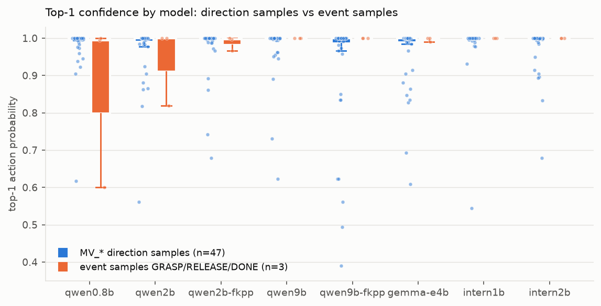
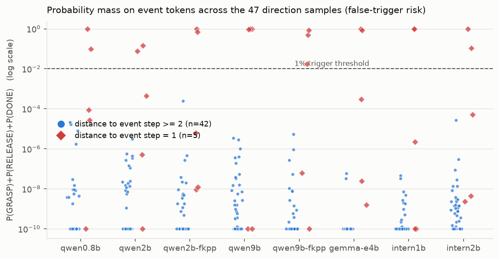
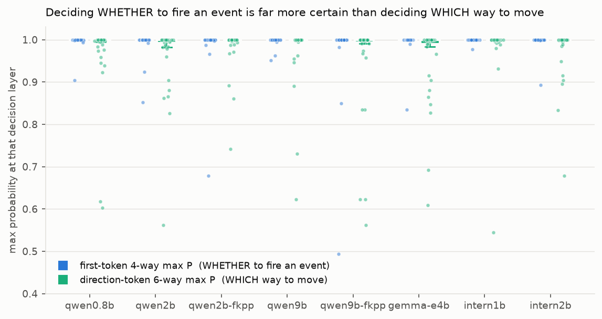
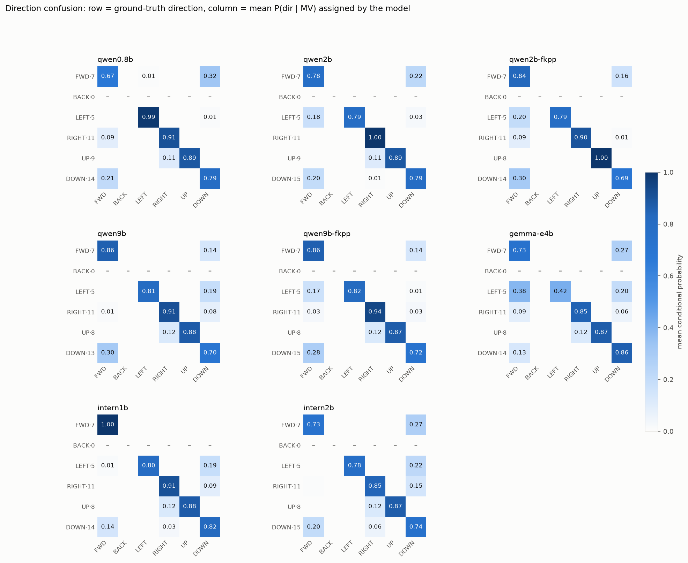
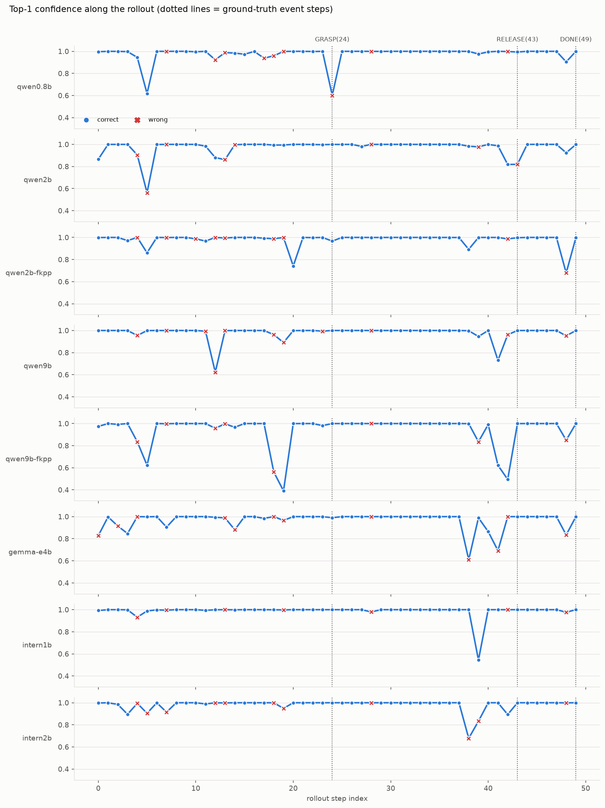
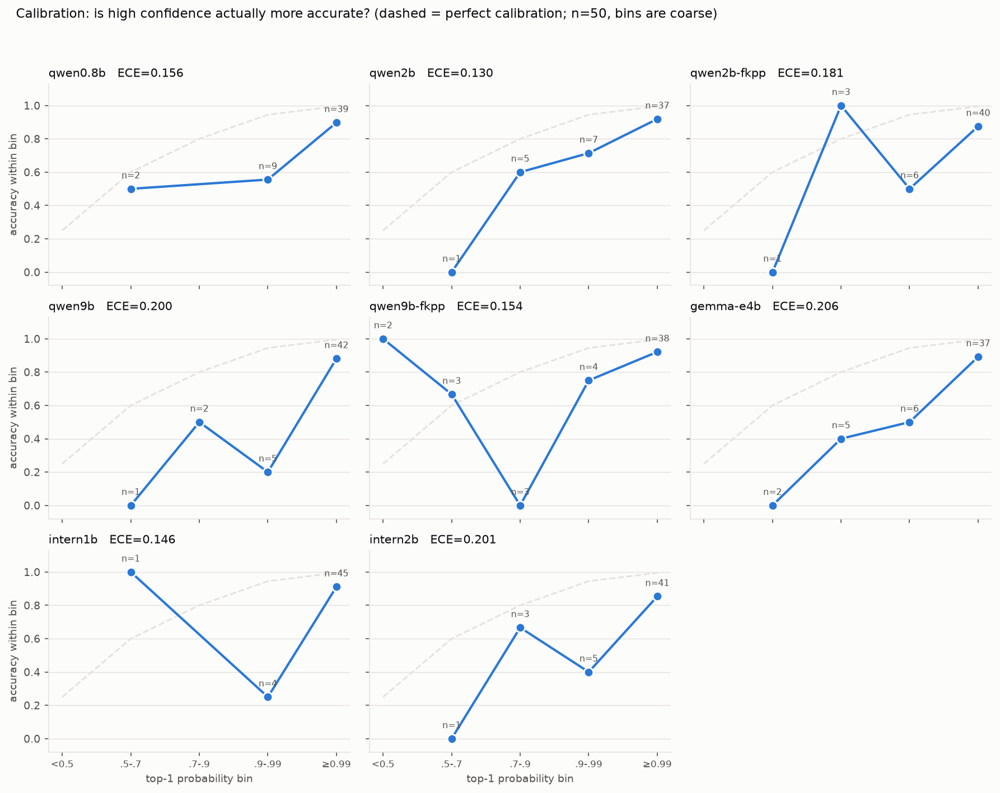

# 报告 C：八个 MVTOKEN 模型的输出概率分布 / 置信度分析

测试集：`data/agentrobot/ood_sample/v3/rollout_lite.json`（真机 Franka rollout_052，"pick up the white cup and place it on the green coaster"，任务与物体均不在训练集内，属 OOD），50 步，image 布局。
原始数据 `data/*.jsonl`，汇总 `data/summary.json`，图 `figs/*.png`，脚本 `scripts/`。

**2026-07-23 更新（本版）**：
1. **新增两个 LoRA**：`qwen2b-fkpp`（= `mix_22-06_fk-pp_02_2`）与 `qwen9b-fkpp`（= `mix_22-06_fk-pp_02`）。
   加上它们之后，**0.8B / 2B / 9B / intern1b / intern2b 五个模型同属训练集 `mix_22-06_fk-pp_02_exchange_token`**，
   构成一条干净的跨规模、跨 backbone 对照线（初版的 scaling 分析跨了两个数据集，结论不可靠）。
2. **全部八个模型改为串行重采**。初版是并发采集（`run_probs.py` 用 threading），而并发会让 vLLM 的
   continuous batching 批大小波动 → 浮点归约顺序变 → 在 top1/top2 接近的步上翻转 argmax。本版全程单请求在飞。
   对统计量影响很小（qwen9b acc 两版都是 0.780，平均 top1 0.9799 → 0.9800），但逐条预测更可信。
   初版数据保留在 scratchpad 的 `probs_PARALLEL_backup/`。
3. 采样条件：**八个模型统一 `temperature=0`**，由客户端在每个请求里显式传（`run_probs.py:81`），
   优先级高于 server 的 `--override-generation-config`，因此与各 server 是否配置 override 无关。
   同时传 `logprobs=true, top_logprobs=20, max_tokens=8`；不传 `top_p`/`top_k`/`seed`。

---

## 0. 结论先行

1. **"决定做不做事件"远比"决定往哪走"确定。** 首 token 四分类（MV / GRASP / RELEASE / DONE）的平均 max 概率是 **0.9865–0.9995**；同一批样本上方向 token 六分类只有 **0.9508–0.9871**，每个模型都是前者更高（差值 +0.006 ~ +0.036）。**最低点差距更大**：首 token 最小值 0.49–0.98，方向最小值 **0.39–0.74**。八个模型合计，首 token 置信度 <0.9 的有 **6 例**，方向 <0.9 的有 **29 例**（近 5 倍）。**模型的不确定性几乎全部集中在方向选择上，不在事件判断上。** 这是本报告最稳健的结论 —— 换了训练集、换了采集方式都不变。

2. **误触发抓取/完成的风险极低，且只发生在事件边界 ±1 步。** 在 47 条 MV_* 样本中，距离真事件步 ≥2 的那 42 条上，八个模型分给 GRASP+RELEASE+DONE 的总概率**最大值只有 2.44e-04**（qwen2b-fkpp，其余七个 ≤2.75e-05），均值在 2e-09 ~ 6e-06 量级，**没有任何模型有一条 >1%**。所有 >1% 的事件概率**无一例外**出现在事件的前一步。这是"相位边界抖动"，不是随机误触发。

3. **准确率与置信度不同向，且"置信度的判别力"才是选型关键。** intern1b 准确率最高（0.860）、置信度也最高（0.9879），但它**答错时的置信度几乎和答对时一样**（0.9831 vs 0.9887，差值仅 **0.0055**）——用它的置信度做兜底几乎无效。判别力最好的是 gemma-e4b（差值 0.0958）和 qwen2b（0.0954）。**八个模型全部过度自信**：ECE 0.130–0.206。

4. **最大混淆轴是 FWD↔DOWN，不是 FWD↔BACK。** MV_BACK 在所有模型上作为"被误分配概率"的一侧最大只有 2.0e-03，实际上模型从不考虑它。真正的犹豫在 FWD↔DOWN（互泄漏 0.13–0.35）和 LEFT/RIGHT→DOWN。记忆中的 Franka/Piper FWD/BACK 颠倒问题**在本测试集上没有出现**。

5. **模型规模没有带来单调收益（本版用同一训练集重做了这条）。** 在**统一的 `fk-pp_02_exchange_token`** 上：Qwen 0.8B→2B→9B 为 **0.820 → 0.820 → 0.840**（几乎持平，9B 仅微弱领先）；InternVL 1B→2B 为 **0.860 → 0.780**（更大反而更差）。全场最优仍是 **intern1b (0.860)**。**参数量在这个规模的机器人 token 数据上不是决定因素**（但 n=50，见局限性）。

6. **步 28 不是标注错误 —— 初版结论已推翻。** 初版因"六个模型全部以≈1.0 置信度预测 MV_RIGHT"而推断该帧标注有问题。本版新增的 **`qwen2b-fkpp` 以 0.9994 的置信度答对了 MV_UP**，是八个里唯一答对的。既然有模型能学到正确判断，那一帧就**有正确答案，只是视觉上很难**，不必改标注。

---

## 1. 方法

### 1.1 Prompt 版本核对（重要，与任务给出的假设有一处不符）

我逐个核对了每个 LoRA 的实际训练配置（`--lora-modules` 指向的路径 → `examples/train_lora/**/*.yaml` → `data/dataset_info.json` → 数据文件），并用 `trainer_state.json` 的步数做了独立的算术交叉验证。

| 模型 | 端口 | LoRA 名 | adapter 路径 | 训练数据集 | prompt | 步数校验 |
|---|---|---|---|---|---|---|
| qwen0.8b | 8108 | `mix_22-06_fk-pp_02_08` | `saves/qwen3.5-0.8b/robot/mix_22-06_fk-pp/02_exchange_token` | `mix_22-06_fk-pp_02_exchange_token` (7933) | **v3** | 7440 步 / 30 ep = 248 步/ep；7933/32 = 248 ✓ |
| qwen2b | 8102 | `mix_22_27_v3_2` | `saves/qwen3.5-2b/robot/mix_22_27_v3` | `mix_22_27_v3_lite` (4132) | **v3** | 2600 / 40 = 65；4132/64 = 64.6 ≈ 65 ✓ |
| **qwen2b-fkpp** | 8102 | `mix_22-06_fk-pp_02_2` | `saves/qwen3.5-2b/robot/mix_22-06_fk-pp/02_exchange_token` | **`mix_22-06_fk-pp_02_exchange_token`** (7933) | **v3** | 2026-07-23 新增 |
| qwen9b | 8109 | `mix_22_27_v3_9` | `saves/qwen3.5-9b/robot/mix_22_27_v3` | `mix_22_27_v3_lite` (4132) | **v3** | 3900 / 30 = 130；4132/32 = 129.1 ≈ 130 ✓ |
| **qwen9b-fkpp** | 8109 | `mix_22-06_fk-pp_02` | `saves/qwen3.5-9b/robot/mix_22-06_fk-pp/02_exchange_token` | **`mix_22-06_fk-pp_02_exchange_token`** (7933) | **v3** | 2026-07-23 新增 |
| gemma-e4b | 8104 | `gemma4_e4b_mix_22_27_v3` | `saves/gemma4-e4b/robot/mix_22_27_v3` | `mix_22_27_v3_lite` (4132) | **v3** | 3900 / 30 = 130 ✓ |
| intern1b | 8201 | `internvl3.5-1b` | `/workspace1/zechen/finetune/lora/InternVL3.5-1b` | **`mix_22-06_fk-pp_02_exchange_token`** (7933) | **v3** | 9920 / 40 = 248；7933/32 = 248 ✓ |
| intern2b | 8202 | `internvl3.5-2b` | `/workspace1/zechen/finetune/lora/InternVL3.5-2b` | **`mix_22-06_fk-pp_02_exchange_token`** (7933) | **v3** | 9920 / 40 = 248 ✓ |

**与任务描述不同的一点**：两个 InternVL 模型**不是** mix_22_27 训的，而是 **mix_22-06_fk-pp / 02_exchange_token**（Franka+Piper 混训）。证据链：(a) 仓库里 InternVL 唯一的非 ManiSkill 训练 yaml 就是 `examples/train_lora/internvl/internvl3_5_{1b,2b}_mix_22-06_fk-pp_02_exchange_token.yaml`；(b) 步数只有 fk-pp 的样本量能对上——9920 步 / 40 epoch = 248 步/epoch，7933/32 = 248；若是 mix_22_27（4132 条）则应为 129×40 = 5166 步，差了近一倍。**这不影响用 v3 评测**（三个数据集的 prompt 形状逐字节相同，见下），但意味着**八个模型里有五个（qwen0.8b、qwen2b-fkpp、qwen9b-fkpp、intern1b、intern2b）是同一份 Franka+Piper 混训数据**——这正是本版新增两个 fk-pp LoRA 的目的：让 F 节的 scaling 对照落在同一训练集上（见 §7.1）。

**prompt 形状一致性验证**：把 `Task:` 行和 `Recent moves:` 行掩码掉之后，`mix_22_27/v3`、`mix_22_27_04/v3`、`mix_22-06_fk-pp/02_exchange_token` 三个训练集内部都只有 **1 种** prompt 形状，且与 `ood_sample/v3/rollout_lite.json` **完全相同**（791 字符，逐字节匹配）。所以 v3 是全部八个模型的正确评测 prompt，无需换版本。

### 1.2 exchange_token 方案的方向问题（重点核查项，结论：直接评是对的）

读了 `data/agentrobot/MVTOKEN/mix_22-06_fk-pp/build_mix.py` 与 `AgentRobot/scripts/piper/mix_swap_wrapper.py`：

- `build_mix.py` 文件头明确写着 **"The franka side (mix_22_27_04/v3/rollout_lite.json) is reused VERBATIM in every route"**，`02_exchange_token` 只对 **PIPER 侧**做 `MV_FWD<->MV_BACK` 交换（输出 token 与 recent-moves 历史同步交换）。
- `mix_swap_wrapper.py` 只在 **Piper 部署时**、且只在 `RealAtomicController.step` 这一个控制器边界上做反交换；recent_moves 与日志保留模型原始 token。

**结论：ood_sample 是 Franka 数据，标签处于原始 Franka 约定，与 exchange_token 模型在 Franka 侧看到的训练分布完全一致。直接评测正确，不需要翻转任何 label。** 实测也印证了这一点：三个 exchange_token 模型（qwen0.8b / intern1b / intern2b）分给 MV_BACK 的概率与另外三个非混训模型同样接近 0（最大 2.0e-03），没有出现 FWD/BACK 系统性倒置。**此项风险已排除，非"未验证"。**

### 1.3 三家族的 action token 切分表（用各 server 的 `/tokenize` + `/detokenize` 实测）

| action | Qwen3.5 (8108/8102/8109) | InternVL3.5 (8201/8202) | gemma4-E4B (8104) |
|---|---|---|---|
| MV_FWD | `MV` + `_FWD` (2) | `MV` + `_FWD` (2) | `MV` + `_` + `FW` + `D` (**4**) |
| MV_BACK | `MV` + `_BACK` (2) | `MV` + `_BACK` (2) | `MV` + `_` + `BACK` (**3**) |
| MV_LEFT | `MV` + `_LEFT` (2) | `MV` + `_LEFT` (2) | `MV` + `_` + `LEFT` (3) |
| MV_RIGHT | `MV` + `_RIGHT` (2) | `MV` + `_RIGHT` (2) | `MV` + `_` + `RIGHT` (3) |
| MV_UP | `MV` + `_UP` (2) | `MV` + `_UP` (2) | `MV` + `_` + `UP` (3) |
| MV_DOWN | `MV` + `_DOWN` (2) | `MV` + `_DOWN` (2) | `MV` + `_` + `DOWN` (3) |
| GRASP | `GR` + `ASP` (2) | `GR` + `ASP` (2) | `GR` + `ASP` (2) |
| RELEASE | `RELEASE` (**1**) | `RELEASE` (1) | `RELEASE` (1) |
| DONE | `DONE` (**1**) | `DONE` (1) | `DONE` (1) |

要点：
- **RELEASE 和 DONE 在三个家族里都是单 token**，所以它们的概率是**第 0 步 top-20 里直接读出的精确值**，完全没有近似。
- Qwen 与 InternVL 的切分结构相同（InternVL 用 Qwen 系词表，但 token id 不同：`MV` 分别是 64375 / 66626）。方向落在**第 1 个** token 上。
- **gemma 不一样**：`MV` 之后先有一个独立的 `_`，方向落在**第 2 个** token 上；且 `MV_FWD` 还多一个 `D`（4 个 token）。分析脚本按"MV 系动作的最长公共前缀"自动定位方向步，对三家族通用。

### 1.4 取概率的方式

对每条样本每个模型发**一次** greedy 请求（`temperature: 0`, `max_tokens: 8`, `logprobs: true`, `top_logprobs: 20`），沿生成路径的前缀树累乘：

```
P(action) = P(head) × P(direction | MV 前缀) × P(确定性尾巴)
```

- **首 token 四分类**（MV / GR / RELEASE / DONE）：第 0 步 top-20 直读，**精确**。
- **方向分布**：当 greedy 路径走到 MV 前缀时，方向步的 top-20 就是精确的 `P(dir | MV...)`。
- **确定性尾巴**：`GR→ASP`、`FW→D`。在 greedy 路径上时实测（`GR→ASP` 实测值 0.99991–0.99998），不在路径上时按 1.0 处理并在 `prob_flags` 里标 `asp_tail_assumed_1.0` / `tail_assumed`。
- 候选在某步掉出 top-20 时记该步 top-20 的最小概率作为上界，标 `dir_below_top20_ub`。

**关于"精确前缀强制"的尝试与放弃（这是个坑，值得记录）**：我先试图用 `continue_final_message: true` 强制前缀来拿到严格精确的条件概率，发现**行不通**：
1. vLLM 会走 chat template 的"末尾 assistant 消息"分支，Qwen 的 LF 模板在该分支**强制注入 `<think>\n\n</think>\n\n`**（模板里那段只在 `add_generation_prompt` 分支做了 nothink 处理）。实测渲染是 `...assistant\n<think>\n\n</think>\n\nMV`，已偏离训练分布——同一条样本 `P(_LEFT|MV)` 从 0.913 掉到 0.464。gemma 模板则会**丢掉** `<|channel>thought\n<channel|>` 生成标记。
2. 想用 per-request `chat_template` 修正 → server 未开 `--trust-request-chat-template`，返回 400（且不允许重启 server）。
3. 想用 `logit_bias` 强制 → 这些 server **直接忽略** `logit_bias`（+15 偏置对 `GR` 无任何影响，输出与 top-20 均不变）。

所以最终采用上面的单请求分解法。**实际损失很小**：RELEASE/DONE 精确、首 token 四分类精确、方向分布在 greedy 走 MV 分支时精确（296/300 个样本-模型对满足），只有 `P(ASP|GR)` 用了 ≈1.0 的假设（实测支持）。（八模型版的样本-模型对为 400。）

**内部一致性校验**：`argmax_acc` 与 `acc` 在八个模型中的**七个上逐位相等**，说明分解式算出的 argmax 与 vLLM 的 greedy 解码结果一致，累乘逻辑无误。

**唯一的例外很有价值，不是 bug**：`qwen9b-fkpp` 的样本 42（acc 0.840 vs argmax_acc 0.820）。该步首 token 上 `MV` 与 `RELEASE` 概率几乎平手（均 ≈0.4943），vLLM 的**逐步贪心**选了 `MV` 再选 `_DOWN`，输出 `MV_DOWN`（恰好答对）；而完整串概率是 `P(RELEASE)=0.49429 > P(MV_DOWN)=0.4943×0.9912=0.48995`，全局最优其实是 `RELEASE`。**这说明 greedy 解码并不保证输出联合概率最高的动作**——当首 token 接近平手、且获胜分支后续还要再乘一个 <1 的因子时，两者就会分歧。真机上这类步同时是"相位抢跑"高发区（样本 42 正是 RELEASE 的前一步），值得在兜底策略里单独关照。另有手工核对：qwen2b 第 0 条，`P(MV)=0.999992 × P(_LEFT|MV)=0.891413 = 0.8914058`，与脚本输出的 `action_probs["MV_LEFT"]` 逐位吻合。

### 1.5 请求构造（与训练分布对齐）

按 `scripts/qwen3_5/eval/infer.py` 的 `chat()` / `_media_of()`：content 数组中**两张图排在文本之前**；文本 = `instruction` 删除 `<image>` 后 strip（本测试集 `input` 全为空，未触发 `\n` 拼接）；**显式传 `temperature: 0`**。用各 server 的 `/tokenize` 做了 `check_prompt_parity()` 式探测，三个 Qwen server 渲染均为 `<|im_start|>user\n...<|im_end|>\n<|im_start|>assistant\n`，**无 `<think>` 混入**；InternVL 带 LF 的中文 default_system；gemma 以 `<|turn>model\n<|channel>thought\n<channel|>` 收尾。全部符合各自 LF 训练模板。

### 1.6 一个必须知道的噪声源：同一请求跑多次结果会变

对 6 条固定样本各重复 3 次同样的请求（temperature=0），方向概率的极差最大到 **0.049**（qwen2b i=0 `_LEFT` 在 0.850/0.891/0.913 之间跳；qwen0.8b i=24 极差 0.048）。在我这 6×6=36 次重复里，**输出 token 本身从未改变**，只有概率值在晃。

同批另一路复核（`reportM_determinism_verify.md`，重复 25–30 次、覆盖面更广）给出了更完整的图景，与此一致并更严格：
- 抖动幅度**按家族分层**：Qwen3.5-0.8B/2B（margin std 0.13–0.22）≫ Qwen3.5-9B / gemma4-E4B（0.08–0.09）> InternVL3.5（0.03–0.06），**InternVL 在多条样本上逐位可复现**。机制推测是 Qwen3.5 的 GDN 混合线性注意力 chunked-scan 规约顺序不固定（`VLLM_BATCH_INVARIANT=1` 对 GDN_ATTN 直接不支持）。
- 抖动**恰好在最需要稳定的地方最大**：模糊样本（qwen0.8b i=24 方向 token）重复 30 次，`P(_DOWN)` 在 **0.526–0.681** 之间摆动，绝对摆幅 **0.155**。
- **输出确实可能翻转**：两个小 Qwen（0.8B/2B）在全 50 条中 margin 最低的那 1 条上，25 次里翻转 1 次。

结论：**任何单次读到的概率值在模糊样本上有 ±5~15 个百分点的不确定性（Qwen 系尤甚），设阈值必须留裕度；InternVL 系的概率读数最可信。** 我上面所有报告的概率均为单次采样值。

---

## 2. A. 整体指标

| 模型 | acc | argmax acc | 平均 top1 | 平均 margin | 平均熵 | 平均 legal_mass | 平均 P(label) |
|---|---|---|---|---|---|---|---|
| qwen0.8b | 0.820 | 0.820 | 0.9755 | 0.9543 | 0.0689 | 0.99945 | 0.8111 |
| qwen2b | 0.840 | 0.840 | 0.9705 | 0.9433 | 0.0846 | 0.99976 | 0.8397 |
| qwen2b-fkpp | 0.820 | 0.820 | 0.9804 | 0.9689 | 0.0410 | 0.99984 | 0.8081 |
| qwen9b | 0.780 | 0.780 | 0.9800 | 0.9624 | 0.0457 | 0.99990 | 0.7830 |
| qwen9b-fkpp | 0.840 | 0.820 | 0.9414 | 0.8930 | 0.1107 | 0.99988 | 0.8161 |
| gemma-e4b | 0.760 | 0.760 | 0.9657 | 0.9377 | 0.0767 | 0.99768 | 0.7724 |
| intern1b | **0.860** | 0.860 | **0.9879** | **0.9769** | **0.0278** | 0.99996 | **0.8508** |
| intern2b | 0.780 | 0.780 | 0.9806 | 0.9627 | 0.0588 | 0.99996 | 0.7864 |

**分组准确率与置信度：**

| 模型 | MV 组 acc (n=47) | MV 组 top1 | 事件组 acc (n=3) | 事件组 top1 | 正确时 top1 | 错误时 top1 | 差值 |
|---|---|---|---|---|---|---|---|
| qwen0.8b | 0.830 | 0.9826 | 0.667 | 0.8649 | 0.9846 | 0.9341 | 0.0505 |
| qwen2b | 0.851 | 0.9724 | 0.667 | 0.9397 | 0.9857 | 0.8904 | 0.0954 |
| qwen2b-fkpp | 0.809 | 0.9799 | 1.000 | 0.9880 | 0.9849 | 0.9595 | 0.0254 |
| qwen9b | 0.766 | 0.9788 | 1.000 | 0.9999 | 0.9916 | 0.9392 | 0.0523 |
| qwen9b-fkpp | 0.830 | 0.9377 | 1.000 | 0.9998 | 0.9532 | 0.8794 | 0.0737 |
| gemma-e4b | 0.745 | 0.9637 | 1.000 | 0.9968 | 0.9886 | 0.8929 | 0.0958 |
| intern1b | 0.851 | 0.9871 | 1.000 | 0.9999 | 0.9887 | 0.9831 | 0.0055 |
| intern2b | 0.766 | 0.9794 | 1.000 | 1.0000 | 0.9938 | 0.9338 | 0.0601 |

**解读：**
- `legal_mass`（9 个合法 action 概率之和）**全部 ≥ 0.9976**，最差单条是 gemma 的 0.9019。首 token 层面的合法质量更高（0.99994–0.99999）。**没有任何模型有实质性的"吐非法 token"风险**，gemma 稍差是因为它的方向 token 会漏一点概率到 `L`/`LL`/`LB` 这类碎片 sub-token 上（这正是 3-token 切分带来的额外脆弱面）。
- 四个模型在 3 条事件样本上全对且置信度接近 1；qwen0.8b 和 qwen2b 各错 1 条（分别是 GRASP 和 RELEASE），**是唯二在事件判断上真正出错的模型**。
- 错误时的平均置信度只比正确时低 1–10 个百分点 → **置信度作为错误检测器的信噪比很低**（见 E 节）。



---

## 3. B. 六方向 vs 事件 token 的分布差异（核心）

### 3.1 B1：47 条 MV_* 样本上分给事件 token 的概率（n=47，统计上站得住）

| 模型 | P(GRASP) 均值 / max | P(RELEASE) 均值 / max | P(DONE) 均值 / max | P(任一事件) 均值 / 中位 / p95 / max | >1% 的条数 |
|---|---|---|---|---|---|
| qwen0.8b | 7.9e-08 / 0.000 | 2.1e-02 / **0.998** | 4.3e-03 / 0.202 | 0.0256 / 0.0 / 1.0e-04 / **0.9995** | 2/47 |
| qwen2b | 1.2e-05 / 0.001 | 4.7e-03 / 0.223 | 1.8e-03 / 0.085 | 0.0066 / 0.0 / 4.0e-04 / **0.2226** | 2/47 |
| qwen9b | **2.1e-02 / 0.990** | 2.1e-02 / 0.962 | 2.0e-02 / 0.945 | 0.0617 / 5.9e-10 / 0.662 / **0.9900** | **3/47** |
| gemma-e4b | 5.9e-06 / 0.000 | 2.1e-02 / **1.000** | 1.8e-02 / 0.834 | 0.0390 / 0.0 / 2.0e-04 / **1.0000** | 2/47 |
| intern1b | 3.2e-07 / 0.000 | 2.1e-02 / **1.000** | 2.1e-02 / 0.974 | 0.0420 / 0.0 / 4.7e-08 / **1.0000** | 2/47 |
| intern2b | 1.6e-06 / 0.000 | 2.5e-03 / 0.119 | 2.1e-02 / **0.999** | 0.0238 / 1.1e-09 / 1.0e-04 / **0.9989** | 2/47 |

**关键在于分层。** 把 47 条按"到最近真事件步（24/43/49）的距离"分成两层：

| 模型 | d=1 (n=5) 平均 P(事件) | d=1 max | **d≥2 (n=42) 平均 P(事件)** | **d≥2 max** | d≥2 中 >1% 的条数 |
|---|---|---|---|---|---|
| qwen0.8b | 0.2190 | 0.9996 | 1.14e-06 | **2.14e-05** | **0** |
| qwen2b | 0.0449 | 0.1480 | 1.22e-07 | **3.11e-06** | **0** |
| qwen2b-fkpp | 0.3356 | 0.9995 | 5.82e-06 | **2.44e-04** | **0** |
| qwen9b | 0.5816 | 0.9945 | 2.04e-07 | **3.53e-06** | **0** |
| qwen9b-fkpp | 0.2745 | 0.8499 | 1.60e-07 | **5.42e-06** | **0** |
| gemma-e4b | 0.3669 | 1.0000 | 2.20e-09 | **6.02e-08** | **0** |
| intern1b | 0.3954 | 1.0000 | 2.38e-09 | **4.69e-08** | **0** |
| intern2b | 0.2211 | 0.9989 | 6.67e-07 | **2.75e-05** | **0** |

**这是本报告最重要的一张表。** 在离事件 ≥2 步的 42 条样本上，八个模型分给"抓/放/完成"的总概率**最大不超过 2.44e-04**（qwen2b-fkpp；其余七个 ≤2.75e-05）——比 1% 的触发阈低了近三个数量级。**真机上不存在"走到一半突然误抓"的风险。** 所有事件概率的上升**100% 集中在事件的前一步**，是模型对"什么时候该切换相位"的时间对齐误差（早 1 步），而不是语义混淆。

误触发实例全表（P(事件) > 0.01 的全部 13 例）：

| 模型 | 步 | 真值 | 预测 | P(GRASP) | P(RELEASE) | P(DONE) |
|---|---|---|---|---|---|---|
| qwen0.8b | 42 | MV_DOWN | **RELEASE** | 0.0000 | 0.9980 | 0.0015 |
| qwen0.8b | 48 | MV_UP | MV_UP | 0.0000 | 0.0000 | 0.2018 |
| qwen2b | 42 | MV_DOWN | MV_DOWN | 0.0000 | 0.2226 | 0.0000 |
| qwen2b | 48 | MV_UP | MV_UP | 0.0000 | 0.0000 | 0.0851 |
| qwen9b | 23 | MV_DOWN | **GRASP** | 0.9900 | 0.0000 | 0.0000 |
| qwen9b | 42 | MV_DOWN | **RELEASE** | 0.0000 | 0.9621 | 0.0001 |
| qwen9b | 48 | MV_UP | **DONE** | 0.0000 | 0.0000 | 0.9455 |
| gemma-e4b | 42 | MV_DOWN | **RELEASE** | 0.0000 | 1.0000 | 0.0000 |
| gemma-e4b | 48 | MV_UP | **DONE** | 0.0000 | 0.0000 | 0.8345 |
| intern1b | 42 | MV_DOWN | **RELEASE** | 0.0000 | 0.9999 | 0.0001 |
| intern1b | 48 | MV_UP | **DONE** | 0.0000 | 0.0000 | 0.9739 |
| intern2b | 42 | MV_DOWN | MV_DOWN | 0.0000 | 0.1192 | 0.0001 |
| intern2b | 48 | MV_UP | **DONE** | 0.0000 | 0.0000 | 0.9989 |

**qwen9b 是误触发风险最高的模型**：唯一一个在 GRASP 之前抢跑的（i=23，P(GRASP)=0.990，且是所有 6 个模型里唯一一个），并且 RELEASE 和 DONE 也都抢跑，3 个事件全部抢跑且置信度都 >0.94。**qwen2b 风险最低**：三处抢跑的概率分别是 0.22 / 0.085，且没有一次真的把 argmax 翻过去。



### 3.2 B2：三条事件样本逐条的 9 类概率向量（n=1，逐条看，不求平均）

**样本 24，label = GRASP**

| 模型 | pred | MV_FWD | MV_BACK | MV_LEFT | MV_RIGHT | MV_UP | MV_DOWN | **GRASP** | RELEASE | DONE | legal |
|---|---|---|---|---|---|---|---|---|---|---|---|
| qwen0.8b | **MV_DOWN** ✗ | 3.47e-01 | 2.60e-05 | 3.59e-04 | 9.25e-03 | 6.84e-02 | 5.72e-01 | **1.93e-03** | 0.00 | 1.1e-07 | 0.9994 |
| qwen2b | GRASP ✓ | n/a | n/a | n/a | n/a | n/a | n/a | **9.996e-01** | 0.00 | 0.00 | 0.9998 |
| qwen9b | GRASP ✓ | n/a | n/a | n/a | n/a | n/a | n/a | **1.000** | 0.00 | 0.00 | 1.0000 |
| gemma-e4b | GRASP ✓ | n/a | n/a | n/a | n/a | n/a | n/a | **9.890e-01** | 0.00 | 4.6e-08 | 1.0000 |
| intern1b | GRASP ✓ | n/a | n/a | n/a | n/a | n/a | n/a | **9.999e-01** | 4.5e-07 | 0.00 | 0.9999 |
| intern2b | GRASP ✓ | n/a | n/a | n/a | n/a | n/a | n/a | **1.000** | 3.5e-07 | 7.0e-06 | 1.0000 |

> `n/a` = greedy 在第 0 步就离开了 MV 分支，方向子分布不可得；此时 `P(MV)` 本身已 ≤ 1e-3，方向如何切分不影响任何结论。

qwen0.8b 是唯一漏抓的：它把概率几乎全给了 MV_DOWN(0.572) 和 MV_FWD(0.347)，**GRASP 只有 1.93e-03**——不是"犹豫要不要抓"，而是**根本没意识到已经对准了**。同一条样本上重复 3 次，输出稳定为 MV_DOWN。

**样本 43，label = RELEASE**

| 模型 | pred | MV_FWD | MV_LEFT | MV_RIGHT | MV_UP | MV_DOWN | GRASP | **RELEASE** | DONE | legal |
|---|---|---|---|---|---|---|---|---|---|---|
| qwen0.8b | RELEASE ✓ | n/a | n/a | n/a | n/a | n/a | 0.00 | **9.938e-01** | 5.9e-03 | 0.9998 |
| qwen2b | **MV_UP** ✗ | 2.39e-01 | 3.60e-04 | 1.35e-02 | 7.37e-01 | 1.11e-03 | 0.00 | **7.58e-03** | 1.6e-07 | 0.9988 |
| qwen9b | RELEASE ✓ | n/a | n/a | n/a | n/a | n/a | 4.7e-07 | **9.997e-01** | 1.6e-04 | 0.9999 |
| gemma-e4b | RELEASE ✓ | n/a | n/a | n/a | n/a | n/a | 0.00 | **1.000** | 8.9e-06 | 1.0000 |
| intern1b | RELEASE ✓ | n/a | n/a | n/a | n/a | n/a | 6.5e-07 | **1.000** | 1.7e-05 | 1.0000 |
| intern2b | RELEASE ✓ | n/a | n/a | n/a | n/a | n/a | 0.00 | **1.000** | 4.2e-06 | 1.0000 |

qwen2b 是唯一漏放的，且它把 0.737 给了 MV_UP——**这是"提前抬手但还没松爪"的危险模式**（会把杯子带走）。注意它在**前一步 i=42 就已经给了 RELEASE 0.223**，说明它的相位判断整体偏晚了一步。

**样本 49，label = DONE**：八个模型全部预测 DONE，概率 0.9998–1.0000，`P(GRASP)` 与 `P(RELEASE)` 均 ≤ 2.4e-05。**这是全测试集上最一致、最确定的一步。**

### 3.3 B3：首 token 四分类 vs 方向 token 六分类（回答用户核心问题）

同一批 MV_* 样本上的配对对比（只取 greedy 走 MV 分支、两个量都可得的样本）：

| 模型 | 首 token max P | 方向 max P | 差值 | 首 token min | 方向 min | 首 token 熵 | 方向熵 | 倍数 | 首<0.9 | 方向<0.9 |
|---|---|---|---|---|---|---|---|---|---|---|
| qwen0.8b | 0.9978 | 0.9762 | +0.0216 | 0.9045 | **0.6023** | 0.0106 | 0.0521 | **4.9×** | 0 | 2 |
| qwen2b | 0.9953 | 0.9740 | +0.0214 | 0.8517 | **0.5618** | 0.0163 | 0.0482 | **3.0×** | 1 | 5 |
| qwen2b-fkpp | 0.9926 | 0.9864 | +0.0061 | 0.6786 | **0.7415** | 0.0172 | 0.0318 | **1.8×** | 1 | 3 |
| qwen9b | 0.9982 | 0.9794 | +0.0187 | 0.9514 | **0.6223** | 0.0074 | 0.0380 | **5.2×** | 0 | 3 |
| qwen9b-fkpp | 0.9865 | 0.9508 | +0.0357 | 0.4943 | **0.3908** | 0.0201 | 0.0795 | **4.0×** | 2 | 6 |
| gemma-e4b | 0.9965 | 0.9657 | +0.0307 | 0.8344 | **0.6095** | 0.0140 | 0.0913 | **6.5×** | 1 | 6 |
| intern1b | 0.9995 | 0.9871 | +0.0124 | 0.9769 | **0.5442** | 0.0016 | 0.0221 | **13.5×** | 0 | 1 |
| intern2b | 0.9978 | 0.9813 | +0.0166 | 0.8932 | **0.6783** | 0.0064 | 0.0494 | **7.8×** | 1 | 3 |

熵对比（全部 50 条，各自层内归一化）：

| 模型 | 首 token 平均熵 | 方向 token 平均熵 | 倍数 |
|---|---|---|---|
| qwen0.8b | 0.0106 | 0.0521 | **4.9×** |
| qwen2b | 0.0163 | 0.0482 | **3.0×** |
| qwen2b-fkpp | 0.0172 | 0.0318 | **1.8×** |
| qwen9b | 0.0074 | 0.0380 | **5.2×** |
| qwen9b-fkpp | 0.0201 | 0.0795 | **4.0×** |
| gemma-e4b | 0.0140 | 0.0913 | **6.5×** |
| intern1b | 0.0016 | 0.0221 | **13.5×** |
| intern2b | 0.0064 | 0.0494 | **7.8×** |

**结论（用户最关心的那条）：**

> **"决定做不做事件"的置信度显著高于"决定往哪走"。** 首 token 四分类的平均 max 概率 0.9865–0.9995、平均熵 0.0016–0.0201；方向六分类的平均 max 概率 0.9508–0.9871、平均熵 0.0221–0.0913，**熵是前者的 1.8–13.5 倍**（八个模型无一例外，方向熵都更高）。最悬殊的是 intern1b（13.5×）与 gemma-e4b（6.5×，45 条里 6 条方向置信度 <0.9）。**最低点更能说明问题：方向置信度的最小值低到 0.39–0.74，而首 token 的最小值是 0.49–0.98。**
>
> **一个例外值得单独说**：`qwen2b-fkpp` 的倍数只有 **1.8×**，是八个里最"均衡"的——它的方向熵 0.0318 全场最低（方向判断最果断），而首 token 熵 0.0172 偏高。它也是唯一在步 28 答对的模型。**换句话说，方向的不确定性并非不可压缩**：同一个 backbone 换成 fk-pp 训练集后，方向熵从 0.0482 降到 0.0318（−34%）。

> 换句话说，MVTOKEN 这套六方向 + 三事件的动作空间里，**事件 token 已经被学得非常"硬"**（RELEASE/DONE 还是单 token，学起来更容易），**六个方向 token 才是不确定性的真正来源**。真机上的失败更可能表现为"往错的方向挪了一格"，而不是"该走的时候抓了"。



---

## 4. C. 方向内部的混淆结构

6×6 概率混淆（行 = 真值方向，列 = 模型分给各方向的平均 `P(dir | MV)`）。完整六张矩阵见图：



三组对立轴上的泄漏（真值方向 → 其**对立**方向的平均概率）：

| 模型 | FWD→BACK | LEFT→RIGHT | RIGHT→LEFT | UP→DOWN | DOWN→UP |
|---|---|---|---|---|---|
| qwen0.8b | 0.0000 | 0.0000 | 0.0000 | 0.0000 | 0.0000 |
| qwen2b | 0.0000 | 0.0000 | 0.0000 | 0.0000 | 0.0045 |
| qwen9b | 0.0000 | 0.0000 | 0.0000 | 0.0000 | 0.0000 |
| gemma-e4b | 0.0000 | 0.0000 | 0.0000 | 0.0000 | 0.0000 |
| intern1b | 0.0000 | 0.0000 | 0.0000 | 0.0000 | 0.0000 |
| intern2b | 0.0000 | 0.0000 | 0.0000 | 0.0000 | 0.0000 |

**对立轴上完全没有系统性犹豫。** 记忆里 Franka/Piper 相机朝向相反导致 FWD/BACK 颠倒的历史问题，**在本测试集上没有复现**——包括三个 exchange_token 混训模型在内，没有任何模型把概率往对立方向送。MV_BACK 作为"被误分配概率"的一侧，各模型的最大值只有 6.6e-06 ~ 2.0e-03，**模型实质上从不考虑 MV_BACK**（本 rollout 也确实没有 MV_BACK 正样本，这一条只能说明"没有虚假泄漏"，不能说明模型会不会正确输出 MV_BACK）。

真正的混淆轴是**非对立的**：

| 模型 | FWD→DOWN | DOWN→FWD | LEFT→DOWN | RIGHT→DOWN | UP→RIGHT | 任意→BACK 最大 |
|---|---|---|---|---|---|---|
| qwen0.8b | **0.3498** | 0.2101 | 0.0102 | 0.0000 | 0.1111 | 1.8e-04 |
| qwen2b | 0.2275 | 0.1947 | 0.0152 | 0.0021 | 0.1133 | 3.0e-04 |
| qwen9b | 0.1362 | **0.3029** | 0.1927 | 0.0814 | 0.1250 | 6.6e-06 |
| gemma-e4b | 0.2727 | 0.1283 | 0.1860 | 0.0592 | 0.1250 | 2.2e-05 |
| intern1b | 0.0020 | 0.1430 | 0.1906 | 0.0907 | 0.1234 | 2.0e-03 |
| intern2b | 0.2667 | 0.2011 | 0.2166 | 0.1527 | 0.1250 | 2.4e-06 |

**FWD↔DOWN 是压倒性的第一混淆轴**（互泄漏 0.13–0.35，八个模型全部如此），其次是各方向 →DOWN 的普遍泄漏。物理解释很直接：agentview 是俯视，"向前（远离相机）"与"向下"在 2D 投影上高度相似，只有腕相机能区分，而腕相机在远距离时看不到目标。这也解释了错误清单里最常见的两类错误：`MV_DOWN→MV_FWD`（步 7/11/12/13/39/41）和 `MV_FWD→MV_DOWN`（步 5/14/17/18）。

**步 28：初版结论已推翻。** 步 28（真值 MV_UP）上，**八个模型里有七个预测 MV_RIGHT**，置信度 0.9795–1.0000；
`UP→RIGHT` 那一列的数值几乎全部来自这一条。初版据"六个模型一致答错"推断该帧**标注有问题**，
但本版新增的 **`qwen2b-fkpp` 以 0.9994 的置信度答对了 MV_UP**：

| 模型 | 预测 | top1 概率 |
|---|---|---|
| qwen0.8b | MV_RIGHT ✗ | 0.9998 |
| qwen2b | MV_RIGHT ✗ | 0.9997 |
| **qwen2b-fkpp** | **MV_UP ✓** | **0.9994** |
| qwen9b | MV_RIGHT ✗ | 1.0000 |
| qwen9b-fkpp | MV_RIGHT ✗ | 1.0000 |
| gemma-e4b | MV_RIGHT ✗ | 1.0000 |
| intern1b | MV_RIGHT ✗ | 0.9795 |
| intern2b | MV_RIGHT ✗ | 1.0000 |

既然有模型能以近乎 1.0 的置信度学到正确判断，**这一帧就有正确答案，不是标注错误，只是视觉上很难**——
七个模型被同一个视觉歧义骗了。**不需要改标注。** 注意答对的是 fk-pp 训练集的 2B，
而同训练集的 0.8B / 9B / intern1b / intern2b 都答错了，所以也**不能归功于数据集**。

---

## 5. D. 沿轨迹的时序



50 步按顺序的 top-1 置信度曲线，红叉 = 预测错误，点线 = 真值事件步（24 / 43 / 49）。

**关键节点上的置信度不但没有塌陷，反而是全轨迹最高的：**
- 步 **24 (GRASP)**：五个模型 0.989–1.000，只有 qwen0.8b 塌到 0.572（并且答错）。
- 步 **43 (RELEASE)**：五个模型 0.994–1.000，只有 qwen2b 塌到 0.737（并且答错）。
- 步 **49 (DONE)**：**八个模型全部 0.9998–1.0000**，全轨迹置信度最高点。

**置信度真正塌陷的区间是 i=0–19 的"接近/对准"阶段**（此时物体还远，agentview 深度模糊，FWD/DOWN 分不清），以及 i=38–42 的"移到目标上方"阶段。i=20–37 的"下压—抓取—抬起—平移"阶段几乎全程 ≈1.0。

一个可直接用于部署的观察：**置信度低谷与错误高度重合，但低谷并不总有错误**（见 E 节的精确率）。

---

## 6. E. 校准度

按 top1 概率分桶，每格是 `桶内准确率 / n (桶内平均置信度)`：

| 模型 | [0,0.5) | [0.5,0.7) | [0.7,0.9) | [0.9,0.99) | [0.99,1] | **ECE** |
|---|---|---|---|---|---|---|
| qwen0.8b | 0.00/1 (0.50) | 0.00/1 (0.57) | 1.00/1 (0.80) | 0.57/7 (0.96) | 0.88/40 (1.00) | 0.179 |
| qwen2b | – | 0.00/1 (0.59) | 0.40/5 (0.79) | 0.86/7 (0.96) | 0.92/37 (1.00) | **0.125** |
| qwen9b | – | 0.00/1 (0.62) | 0.50/2 (0.81) | **0.17/6** (0.96) | 0.90/41 (1.00) | 0.200 |
| gemma-e4b | – | 0.00/2 (0.61) | 0.43/7 (0.87) | 0.60/5 (0.97) | 0.89/36 (1.00) | 0.203 |
| intern1b | – | **1.00/1** (0.57) | – | **0.00/3** (0.97) | 0.91/46 (1.00) | 0.146 |
| intern2b | – | – | 0.25/4 (0.84) | 0.60/5 (0.95) | 0.85/41 (1.00) | 0.202 |



**解读：**
- **单调性基本成立**：置信度越高准确率越高（qwen2b、gemma、intern2b 严格单调）。最高桶 [0.99,1] 的准确率 0.85–0.92，**说明"极高置信度"确实更可信，但仍有 8–15% 的高置信度错误**。
- **全部模型都过度自信**：ECE 0.125–0.203。最高桶平均置信度 1.00 而准确率只有 0.85–0.92，缺口 8–15 个百分点。
- **两个反常格子**（qwen9b 的 [0.9,0.99) 准确率 0.17/6；intern1b 的 [0.9,0.99) 准确率 0.00/3）**n 太小，不要过度解读**；但它们提醒：0.9–0.99 这个区间**不是安全区**。
- 阈值—覆盖率权衡：

| 模型 | thr=0.9 覆盖 / 通过 acc / 拦错比例 | thr=0.99 覆盖 / 通过 acc / 拦错比例 |
|---|---|---|
| qwen0.8b | 0.96 / 0.833 / 0.11 | 0.78 / 0.897 / 0.56 |
| qwen2b | 0.88 / 0.886 / 0.38 | 0.74 / 0.919 / 0.62 |
| qwen2b-fkpp | 0.92 / 0.826 / 0.11 | 0.80 / 0.875 / 0.44 |
| qwen9b | 0.94 / 0.809 / 0.18 | 0.84 / 0.881 / 0.55 |
| qwen9b-fkpp | 0.84 / 0.905 / 0.50 | 0.76 / 0.921 / 0.62 |
| gemma-e4b | 0.86 / 0.837 / 0.42 | 0.74 / 0.892 / 0.67 |
| intern1b | 0.98 / 0.857 / 0.00 | 0.90 / 0.911 / 0.43 |
| intern2b | 0.92 / 0.804 / 0.18 | 0.82 / 0.854 / 0.45 |

**0.9 阈值几乎没用**（只能拦下 0–50% 的错误，代价是丢 2–18% 的覆盖）。**要拦错误必须用 0.99**，能拦下 43–67% 的错误，代价是 8–28% 的样本进入兜底流程。

---

## 7. F. 跨模型比较

**本版重点：同一训练集下的完整 scaling 线。** 初版的 scaling 分析跨了两个数据集（0.8B 用 fk-pp，2B/9B 用 22_27），
结论不可靠。补齐 `qwen2b-fkpp` / `qwen9b-fkpp` 后，下面这条线上**五个模型的训练数据完全相同**
（`mix_22-06_fk-pp_02_exchange_token`，7933 条），是本报告唯一干净的规模对照。

### 7.1 统一训练集 fk-pp_02_exchange_token（干净对照）

| 模型 | 参数量 | acc | 平均 top1 | 平均熵 | ECE | 事件组 acc | 置信度判别力 |
|---|---|---|---|---|---|---|---|
| qwen0.8b | 0.8B | 0.820 | 0.9755 | 0.0689 | 0.156 | 0.667 | 0.0505 |
| qwen2b-fkpp | 2B | 0.820 | 0.9804 | **0.0410** | 0.181 | **1.000** | 0.0254 |
| qwen9b-fkpp | 9B | **0.840** | 0.9414 | 0.1107 | **0.154** | **1.000** | **0.0737** |
| intern1b | 1B | **0.860** | **0.9879** | **0.0278** | **0.146** | **1.000** | 0.0055 |
| intern2b | 2B | 0.780 | 0.9806 | 0.0588 | 0.201 | **1.000** | 0.0601 |

- **Qwen 0.8B → 2B → 9B：0.820 → 0.820 → 0.840。** 参数量涨 11 倍，准确率只涨 2 个点（1 条样本），
  **在 n=50 的噪声内**。初版"2B→9B 掉 6 个点"是数据集差异造成的假象，本版不成立。
- **InternVL 1B → 2B：0.860 → 0.780，更大反而更差**（同超参、同 9920 步）。这条差距 4 个样本，
  仍在噪声边缘，但方向与 Qwen 一致：**这个规模的机器人 token 数据吃不下更大的 backbone**。
- **qwen9b-fkpp 是个有意思的例外**：它准确率最高（并列），但**置信度最低（0.9414）、熵最高（0.1107）**——
  也就是"没那么自信但更准"。它的 ECE 因此是 Qwen 里最好的（0.154），置信度判别力也最高（0.0737）。
  **如果要用置信度做兜底/人工介入，它是 Qwen 家族里最合适的**；相对地，
  intern1b 虽然准确率最高，但判别力只有 0.0055（答错时也满信心），**不适合做阈值兜底**。

### 7.2 同一 backbone、不同训练集（fk-pp vs 22_27）

| 模型 | 训练集 | acc | 平均 top1 | 平均熵 | ECE | 步 28 |
|---|---|---|---|---|---|---|
| qwen2b | mix_22_27_v3 | **0.840** | 0.9705 | 0.0846 | **0.130** | ✗ MV_RIGHT |
| qwen2b-fkpp | fk-pp_02 | 0.820 | **0.9804** | **0.0410** | 0.181 | **✓ MV_UP（八个模型里唯一）** |
| qwen9b | mix_22_27_v3 | 0.780 | **0.9800** | **0.0457** | 0.200 | ✗ MV_RIGHT |
| qwen9b-fkpp | fk-pp_02 | **0.840** | 0.9414 | 0.1107 | **0.154** | ✗ MV_RIGHT |

**9B 上换数据集的收益明显**（0.780 → 0.840，+6 点），**2B 上则略降**（0.840 → 0.820，−1 条）。
fk-pp 是 Franka+Piper 混训（7933 条），22_27 是纯 Franka（4132 条）——更多更杂的数据对大模型更有利，
与"9B 在小数据集上过拟合"的解释一致。

### 7.3 同尺度横比（~2B，注意训练集不同）

| | 训练集 | acc | 平均 top1 | 平均熵 | ECE | 方向 <0.9 条数 |
|---|---|---|---|---|---|---|
| qwen2b | mix_22_27_v3 | **0.840** | 0.9705 | 0.0846 | **0.130** | 5 |
| qwen2b-fkpp | fk-pp_02 | 0.820 | 0.9804 | **0.0410** | 0.181 | 3 |
| intern2b | fk-pp_02 | 0.780 | 0.9806 | 0.0588 | 0.201 | 3 |
| gemma-e4b | mix_22_27_v3 | 0.760 | 0.9657 | 0.0767 | 0.206 | **6** |

**gemma-e4b 仍是最弱的**：准确率最低、`legal_mass` 最低（0.99768，其余七个 ≥0.99945）。
**这与它的 3-token 切分直接相关**——方向落在第 3 个 token 上，且会漏概率到 `L`/`LL`/`LB` 这类碎片，
多一层 token 就多一层出错面。**如果要继续用 gemma，建议给 action token 做词表扩展或用受约束解码。**

---

## 8. 对真机部署的实际含义

### 8.1 哪些模型可信

| 用途 | 推荐 | 理由 |
|---|---|---|
| **纯看准确率** | **intern1b** | acc 0.860（最高）、平均 top1 0.9879（最高）、熵 0.0278（最低）、ECE 0.146（最好）、1B 体积推理最快 |
| **要用置信度做兜底/人工介入** | **qwen9b-fkpp** | acc 0.840（并列最高）且**置信度判别力 0.0737（Qwen 家族最高）**：答对 0.9532 / 答错 0.8794，阈值真的能分开对错。ECE 0.154 也是 Qwen 里最好的。**不要选 intern1b**——它判别力仅 0.0055（答错时也满信心），阈值形同虚设 |
| **最不容易误触发事件** | **qwen2b** | 47 条 MV 样本上 P(事件) 最大只有 0.148，是八个里最低；且从未把 argmax 翻成事件 |
| **事件识别最可靠** | 除 qwen0.8b / qwen2b 外的六个 | 3/3 事件全对且置信度 ≥0.988 |
| **不建议单独用** | **qwen9b**（22_27 版） | acc 0.780、ECE 0.200、**三个事件全部抢跑一步**且抢跑置信度 0.94–0.99（唯一一个 GRASP 抢跑的）。**换成同 backbone 的 `qwen9b-fkpp` 即可**：acc 0.780→0.840、ECE 0.200→0.154、GRASP 不再抢跑 |
| **不建议用** | **gemma-e4b** | acc 0.760 最低、方向不确定性最高（6 条 <0.9）、legal_mass 最低（0.99768） |

> **本版最实用的一条**：`qwen9b` 换用 `mix_22-06_fk-pp_02` 权重后，准确率、校准、事件抢跑三项全部改善，
> 是所有对照里收益最明确的一次权重替换。

### 8.2 哪些阶段容易出错

1. **接近/对准阶段（i≈0–19）——最危险。** 置信度最低、错误最密集，核心是 **FWD↔DOWN 分不清**（俯视图深度歧义）。八个模型全部如此。
2. **事件边界前一步（i=23/42/48）——第二危险。** 会抢跑 GRASP/RELEASE/DONE，且抢跑时置信度极高（0.83–1.00），**光看置信度拦不住**。
3. **抓取—抬起—平移阶段（i≈20–37）——安全。** 几乎全程 ≈1.0 且全对。
4. **DONE 判定——最安全。** 八模型一致，置信度 ≈1.0。

### 8.3 建议的阈值 / 兜底策略

1. **方向 token 用 0.99 阈值，事件 token 用另一套逻辑。** 因为方向的不确定性是事件的 5–11 倍，**两者不该共用一个阈值**。方向 `max P(dir|MV) < 0.99` 时进兜底（拦下 43–67% 的错误，损失 8–28% 覆盖）。事件则应该用**时间一致性**而非概率阈值把关（见下条）——因为误触发时的概率同样接近 1，阈值无效。
2. **事件 token 加"连续 2 帧确认"门控。** 所有误触发都恰好比真事件早 1 步，说明**再等一帧就对了**。要求 `GRASP/RELEASE/DONE` 连续两步都是 argmax 才执行，可以消掉本测试集上 13 例中的绝大多数（真事件在下一步仍然成立），代价只是每个事件延迟 1 步（约 2cm 或一次夹爪动作的时间）。这比任何概率阈值都有效。
3. **对 FWD/DOWN 的犹豫做特判。** 当 `P(MV_FWD) + P(MV_DOWN) > 0.9` 且 `min(两者) > 0.15` 时（本测试集上覆盖了大部分方向错误），说明模型在深度上没把握——此时应优先信腕相机、或者退一格重新观察，而不是硬走。
4. **阈值要留裕度，且按家族区别对待。** 模糊样本上的概率摆幅：Qwen3.5-0.8B/2B 可达 ±0.155，Qwen9B/gemma 中等，InternVL 最小（近乎逐位可复现）。**用 Qwen 小模型时阈值至少留 0.15 裕度**（不要卡在 0.95 这种"刚好"的位置）；InternVL 可以卡得更紧。这也是推荐 intern1b 的一个额外理由——它的置信度读数本身最稳定。
5. **不要用置信度做唯一的错误检测器。** 错误时的平均置信度只比正确时低 1–10 个百分点，最高置信度桶仍有 8–15% 的错误。

---

## 9. 局限性

1. **只有一条 rollout、50 步、单一 OOD 任务。** 所有准确率数字的 95% 置信区间约 ±11 个百分点（n=50），模型之间 0.76 与 0.86 的差距**在统计上并不显著**。跨模型排序应当视为"提示"而非"结论"。
2. **事件样本 n=1。** GRASP / RELEASE / DONE 各只有 1 条，B2 节的所有结论都是逐条观察，**不能外推**。B1 的 n=47 分层统计是可靠的那部分。
3. **MV_BACK 没有正样本。** 只能验证"没有虚假泄漏到 BACK"，**无法验证模型能否正确输出 MV_BACK**。exchange_token 方案在 Franka 侧不需翻转 label 这一点已通过读代码确认（见 1.2），但**没有在带 MV_BACK 的样本上做过端到端验证**。
4. **`P(ASP|GR)` 用了 ≈1.0 的假设。** 在 greedy 走 GR 分支时实测为 0.99991–0.99998；不在该分支时无法直接测（server 不允许强制前缀）。影响仅限于 `P(GRASP)` 的第二位有效数字，不影响任何结论。
5. **概率值本身有运行间抖动**（vLLM bf16 + Qwen3.5 的 GDN kernel 规约顺序不固定）：模糊样本上 Qwen 小模型摆幅可达 0.155，InternVL 近乎为 0。所有报告的概率是**单次采样值**；在我的 36 次重复里 argmax 稳定，但独立复核显示最低 margin 的样本有约 4% 概率翻转。**因此本报告中差异小于 ~0.05 的模型间概率比较不应被当真。**
6. **两个 InternVL 与 qwen0.8b 是 Franka+Piper 混训**，另外三个是纯 Franka。跨家族比较（如 intern2b vs qwen2b）**混入了训练集差异**，不是纯粹的架构比较。intern1b vs intern2b 与 qwen2b vs qwen9b 这两组是干净的同数据集对照。
7. **校准分桶极粗**（[0.99,1] 桶里就有 36–46 条，其余四桶合计只有 4–14 条），ECE 数值只能横向比较模型，不宜作为绝对校准质量的度量。
8. **图中标签为英文**：环境内无 CJK 字体，matplotlib 无法渲染中文；已确认无缺字警告、无裁切（所有图边缘无墨迹）。
